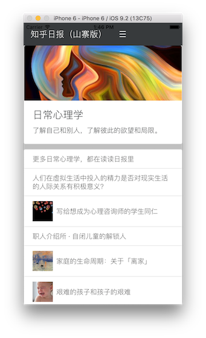

# 一个山寨版的知乎日报客户端

为了练习 Angular2 和 BootStrap4， 于是撸了一个知乎日报的山寨版客户端， 功能很不完善， 只是练习而已。

使用到的技术：

- Cordova
- TypeScript
- Angular2
- BootStrap4

本来以为能够直接在手机上运行， 但是经过测试只能在 iOS 模拟器上运行， 等到 Angular2 完善了再继续吧， 还是有收获的， 那就是熟悉上面列出的这些技术！

